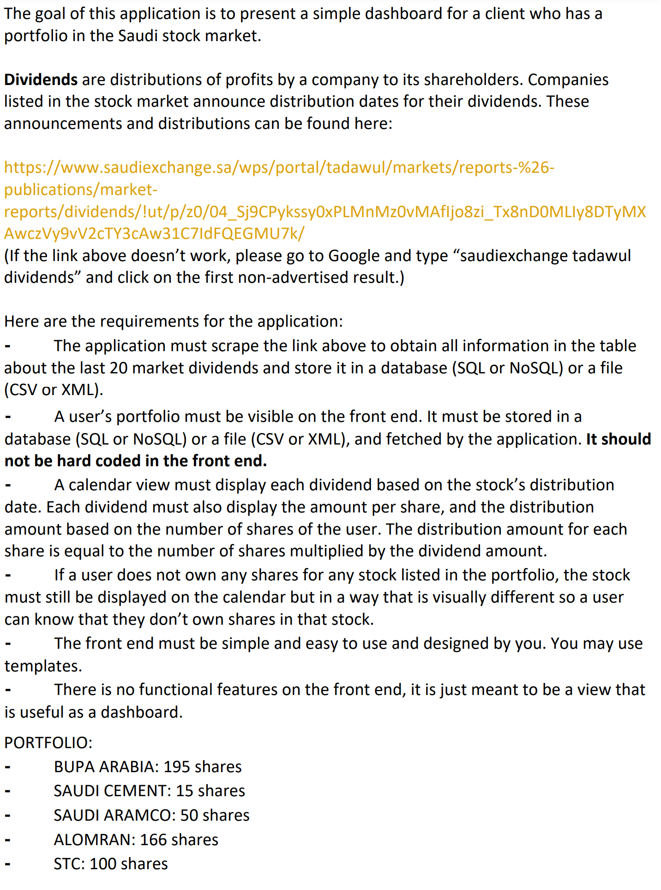

Requirements
------------
 - PHP >= 7.4
 - Laravel >= 8.0
 - Fileinfo PHP Extension

Installation
------------

1- Clone project files into your local machine 
``` bash
git clone git@github.com:MDeeee/Dividends.git
```

2- Install Laravel dependencies
``` bash
composer install
```

3- Run your server
``` bash
php artisan serve
```